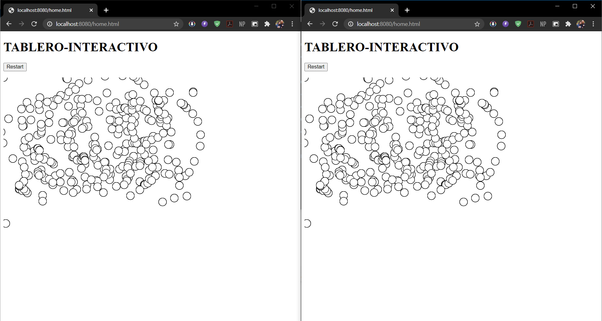

# HOMEWORK 5 ARSW (Interactive Board)

The board should allow multiple users to draw online and provide a delete button. What each person draws should appear on the board of all other people. Each person should start with a different color. Immediately someone presses the clear board button is cleared for everyone.

# START

Copie el proyecto via git clone en cualquier diretorio para empezar a trabajar:
```
git clone https://github.com/Juaco9502/Tablero-Interactivo-Arsw.git
```

## INSTALL

1. Run in terminal:

```
$$ mvn clean package
```

2.(Optional):
If you want to view the documentation of the application, execute the following command and check the following path: root / target:

```
mvn javadoc:javadoc
```

3. (Run):
The following command must be used in the project root folder:
  
```
mvn spring-boot:run
```

4. Open the web browser and enter the following address:

```
http://localhost:8080/home.html
```
### VIEW



## HEROKU
[Link](https://tablero-interactivo.herokuapp.com/home.html)
https://tablero-interactivo.herokuapp.com/home.html

## PRE-REQUISITES

* Java jdk > 7
* Maven (Apache Maven)
* Git
  

## BUILT

* [Maven](https://maven.apache.org/) - Dependency Management
* [JAVA JDK 8](http://www.oracle.com/technetwork/java/javase/overview/index.html) - Building
* [JUnit 3.8.1](https://mvnrepository.com/artifact/junit/junit/3.8.1) - Test


## AUTHOR

* **JUAN CAMILO ORTIZ MEDINA** - [Juaco9502](https://github.com/juaco9502)


## LICENSE

This project is licensed under the GNU General Public License - [LICENSE](LICENSE) 